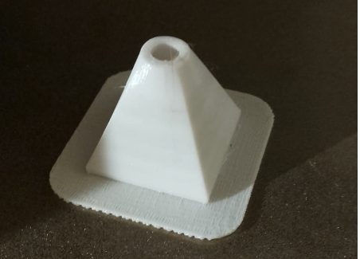

# How to build a beeCounter

## Ingredients

* Cap1188: like [cap1188_bricogeek_spain](https://tienda.bricogeek.com/sensores-capacitivos/647-sensor-capacitivo-cap1188-i2c-spi.html)
* monofilament cable
* ESP32 / piZero / laptot
* 4-wire connector (male and female), outdoor resistant.

## tools

* 3d printer
* A drill (number 7)
* solder... blah, blah, blah
* glue

## Methods

1 print an *escape* in a 3d printer and sand it.

2 Take a piece of single-wire cable and strip the end by screwing it into a #7 drill bit until it makes 2 full turns. Repeat this operation to obtain two cables. These will be the electrodes

3 Print two caps

4 put the drill in the escape, then one electrode, cover it with one cap and glue them all together

5 repeat the operation with the second electrode

6 repeat everything to get four escapes

