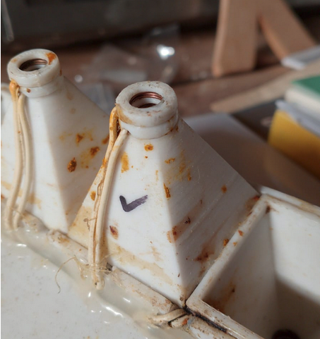

# How to build a beeCounter

instrucciones paso a paso

## Ingredients

* [Cap1188](https://learn.adafruit.com/adafruit-cap1188-breakout?view=all)
    * [aliexpress](https://es.aliexpress.com/item/1005005738604440.html?src=google&src=google&albch=shopping&acnt=439-079-4345&slnk=&plac=&mtctp=&albbt=Google_7_shopping&albagn=888888&isSmbAutoCall=false&needSmbHouyi=false&albcp=18928172568&albag=&trgt=&crea=es1005005738604440&netw=x&device=c&albpg=&albpd=es1005005738604440&gad_source=1&gclid=CjwKCAiAuNGuBhAkEiwAGId4ajzFOiYxF-PCQs6BNmsuf4EdwS8hWUTHrKjOT8w1_6W0O3Fabl1LABoCwGAQAvD_BwE&gclsrc=aw.ds&aff_fcid=302274a35f81487cb9ccc6e240c31657-1708446316171-08122-UneMJZVf&aff_fsk=UneMJZVf&aff_platform=aaf&sk=UneMJZVf&aff_trace_key=302274a35f81487cb9ccc6e240c31657-1708446316171-08122-UneMJZVf&terminal_id=3a1162a8f65f49acbab72c97f7e947d3&afSmartRedirect=y) 6€
    * Mouser
* monofilament cable
* ESP32 (Also Raspberry piZero2W, on your own)
* 4-wire connector (male and female), outdoor resistant.

## Tools

* 3d printer
* A drill (number 7)
* solder... blah, blah, blah
* glue

## Methods

1 Print a escape in a 3d printer. File: **escape.stl**

