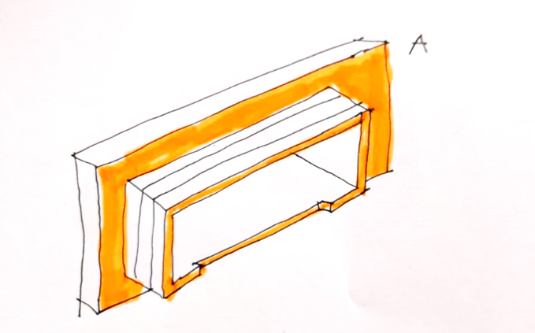
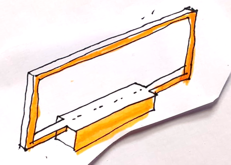
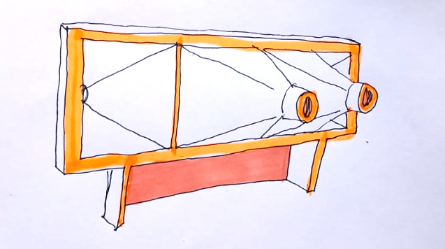

# Planos V2.0

1 Pieza atonillada en la colmena. Fresado en pvc espumado (se puede comprar en Arteplástica). Grosor 1.5? 1.2?

2 Marco que se fija a lo anterior y que se debe poder girar. En este marco se pegan los escapes ya conectados a la electrónica

3 Marco con los escapes pegados y el cajetín (abierto) para alojar la electrónica. Toda esta pieza es la se debe poder quitar y poner de un lado o del otro

