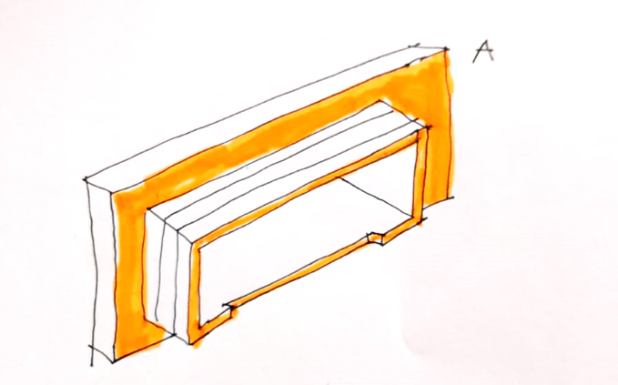
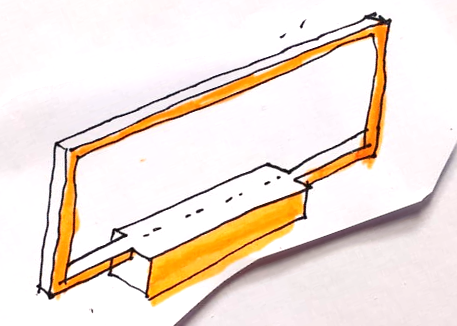
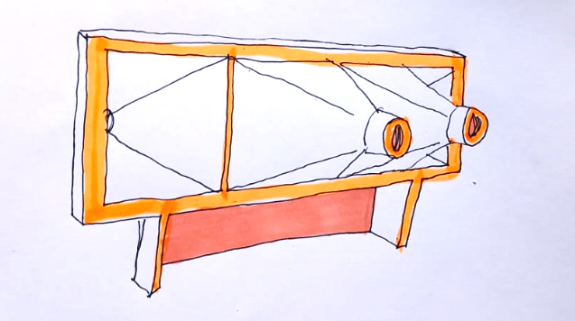
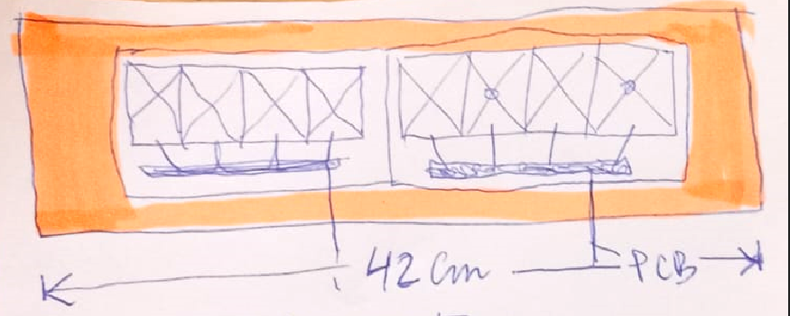
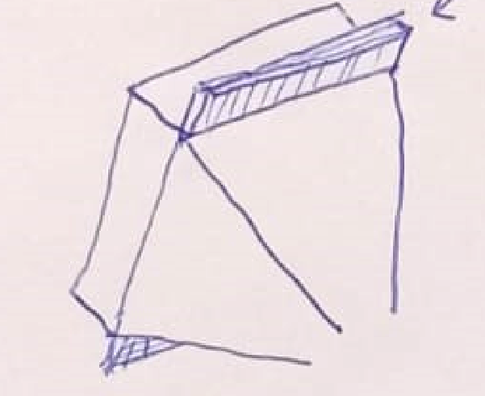
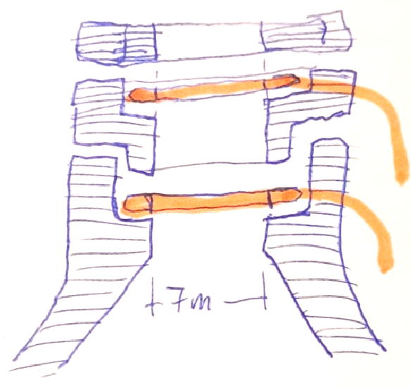
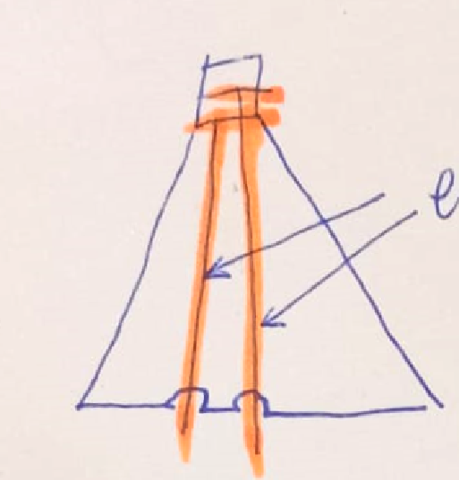

# Planos V2.0

**Diseño**: *David Atauri*
**Modelado y Fabricación**: *Centro de Apoyo Tecnológico (CAT) URJC* 

## Frontal

|||
|-----|-----|
|Pieza atonillada en la colmena. Fresado en pvc espumado (se puede comprar en Arteplástica). Grosor 1.5cm? 1.2cm?|
||Marco que se fija a la pieza anterior y que se debe poder girar. En este marco se pegan los escapes ya conectados a la electrónica | 
|| Marco con los escapes pegados y el cajetín (abierto) para alojar la electrónica. Toda esta pieza es la que se debe poder quitar y poner de un lado o del otro|
||Posibilidad mostar en el mismo frontal 1 o 2 módulos de 4 escapes|

## Escapes
|||
|-----|-----|
||Añadir unas aletas arriba y abajo para facilitar el pegado en el marco|
|| Rediseñar los tapones y el final del cono para faciliatr el montaje y los electrodos queden siempre fijos y a la misma deitancia |
|| Embutir los electrodos en el cono para que las abejas al posarse no afecten a la señal|