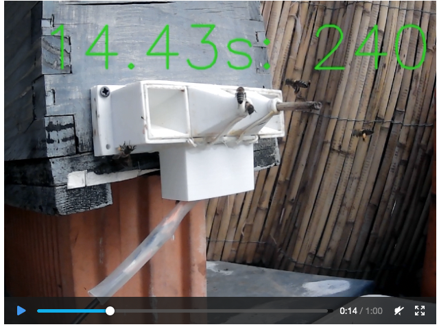
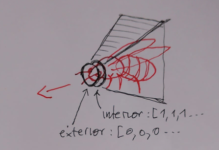
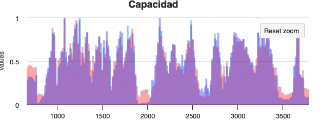

# Counting algorithm development and testing

Counting algorithm is - with the case design and signal capture- the core of the project. This application is intended to develop,
test and improve this algorithm.

## About the data

To train the counting algorithm, a dataset is provided. All the data is related to **only ONE** escape (outgoing). Algorithm and validation must be made in one escape.

Each sample consist of: 

* **video** file named in the format YYYY_MM_DD__hh_mm_ss.mp4: a video of approx. 1 minute of one escape. [Video sampe](http://puturrudefua.es/splendid/capturas/2023_09_30__09_59_28.mp4)



* Array with the **sensor readings** YYYY_MM_DD__hh_mm_ss.json: array with the sensor readings. It is a dicctionary with two arrays ("interior", "exterior") each one is an array of electrode samples (one each 4 milliseconds). Old recordings are in the range 0..1, but newer will be in the range 0..127. [json sample](http://puturrudefua.es/splendid/capturas/2023_09_30__09_59_28.json)
  


*An outgoing bee crossing the electrodes*

```json
  {
    "interior":[1,1,1...],
    "exterior":[0,0,0,0 ...]
  }
```

*Generated json file*


  
*Chart with generated data in the user inteface. Blue is "interior", red is "exterior"*


* YYYY_MM_DD__hh_mm_ss.t_json: array with **synchronisation** information from the video and the electrode readings. Each position in the array relates to a video frame, and its value is the position in the array of samples.If sync[200]=1340 then it means that video frame 200 correspond to samples *interior[1340]* and *exterior[1340]*. 
[Sync sample](http://puturrudefua.es/splendid/capturas/2023_09_30__09_59_28.t_json)


## What is this app for...

This app allows you write a python function to count bees in the buffers of raw data and test it over a bunch of files (video and data) from a real devie and a real hive.

The app has been developed in python (back) and vuejs (front)

## How to start

First see this brief [Youtube explanation](https://www.youtube.com/watch?v=Pkqkp8idgXs) (Use subtitles with translation if you can't speak spanish)

Here is how I work:

* Open the project in VsCode (must have installed extension "live server")
* create a python virtual env and install packages with pip

> python3 conteo.py 

* A bottle server will be started listening on por 8008
* Right click on front_capturas.htm -> open with live server (first install vscode extension)
* Choose a file in the left
* Click "count bees" to see the server response
* Each black line is a detected bee

## Known bugs

(to be fixed one day...)

* If you zoom to a border "play zoomed" won't work
  
## What's next

Once you are happy with your counting function migrate it to your counting microcontroller (maybe an ESP32 or a piZero, or whatever...)
