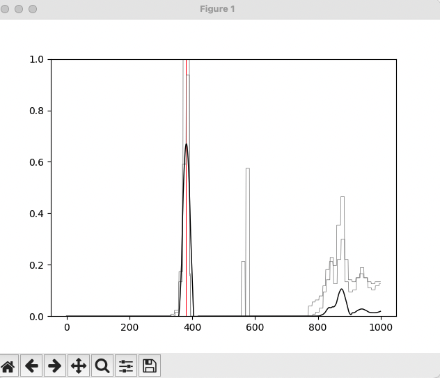

# ESP32 software

* **send2serial.ino**

  * This scketch reads the electrodes in infine loop and sends data throuhg serial port so a more powerfull computer can run the counting algorithm and tests.
  * *countBees.py* let you choose **ONE** escape and plot the data counting the bees with findPeaks algorithm

    

    *One bee was found! (the red bar)*
