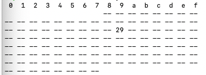

# Raspberry Pi Software

## Pi Zero 2w IMPORTANT NOTES

* Instalar **bookworm 64 bits** usando **raspberry imager** para poder poner directamente el ssh y la wifi sin necesidad de monitor
  
* Aumentar el tamño de swap para arreglar [Vs-code CRASH](https://pimylifeup.com/raspberry-pi-swap-file/)
  
* Instalar la *piCam* con esta [guía](https://forums.raspberrypi.com/viewtopic.php?t=361758)
  
### Utilidades and more

* COPIAR CARPETA DE RPI A LOCAL

    > scp -r tadu@splendidBC.local:/home/tadu/splendid . 

* Traerme los videos y las capturas de splendidBC2
  
    > scp -r tadu@splendidBC2.local:/home/tadu/samples/ .

* Convertir en batch
    > for file in *.h264; do ffmpeg -i "$file" "$(basename "$file" .${file##*.}).mp4"; done

Luego los tengo que subir a titi para poder verlos desde la web 

* una vez conectado CAP1188 por i2c se puede saber si está bien conectado y su direccion con

    > i2cdetect -y 1

    

    Si conecto 2 módulos hay que crear en python los objetos pasándole la dirección i2c (creo, aún no lo he probado)
 
## Python libraries

primero instalar virtualenv, hacer un entorno y activarlo
A continuación instalar librerías de requirements.txt

Empollarse la librería de [cap1188](https://docs.circuitpython.org/projects/cap1188/en/latest/)

## Aplicaciones disponibles

* **count.py** Cuenta los 4 escapes e inserta en MQTT con la mac del dispositivo
* **validate.py** Muestrea los 4 escapes y envía el buffer y las abejas encontradas por el socket a validateFront2.html, doned se puede seleccionar el escape y solicitar una nueva muestra

## TO-DO list

* Invertir la curva para encontrar los valles en lugar de los picos
* Ajustar los parámetros (desde la interfaz?)
* Ajustar parámetros del módulo CAP1188
* Hacer copias de seguridad de la tarjeta
* Poner tarjeta en modo lectura
* Añadir RTC y hacer copia local de los datos