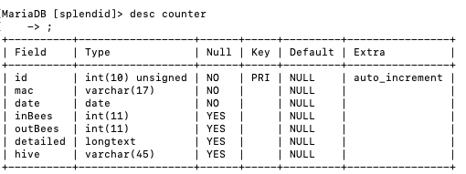

# Server Side

* titi.etsii.urjc.es
* https avilable redirected from https://apinet.com

## Aplicaciones y recursos principales

### Mysql

Los registros del contador se almacenan en la tabla **counter**.
Todas las lecturas de un mismo día se combinan en el MISMO registro.
*inBees* y *outBees* contienen el acumulado y los regiostros de cada lectura se meten en el JSON *detailed*




Ejemplo de *detailed*:

```JSON
{
    "time": ["16:26", "16:26", "16:26", "16:26", "16:26", "16:26", "16:26", "16:26", "16:27", "16:27", "16:27"],
    "in": [0, 2, 3, 4, 5, 6, 8, 9, 12, 13, 14],
    "out": [8, 18, 15, 11, 4, 11, 8, 1, 13, 18, 9]
}
````


### Insert New Data

**mqtt.py** es una aplicación que levanta el servidor *Mosquitto* (puerto por defecto 1883) para escuchar los mensajes de insercion de los diferentes contadores. Las inserciones se hacen publicando un mensaje en el

> topic = "**splendid/insert/counter**"

Para insertar debe recibir un jsonString tal que así:

```json
{
    "mac": "counter mac address",
    "inBees": 65,
    "outBees": 20,
    "timeZone": "Madrid/Europa",
    "user": "logger mac address"
}
```

Fragmento que publica un nuevo registro desde ESP32

```C

const char* mqttServer = "212.230.117.77"; // 
const int mqttPort = 1883;

WiFiClient wifiClient;
Adafruit_MQTT_Client mqtt(&wifiClient, mqttServer, mqttPort);

Adafruit_MQTT_Publish publicador = Adafruit_MQTT_Publish(&mqtt, "splendid/insert/counter", MQTT_QOS_1);
const String zonaHoraria="Europe/Madrid";

String js="{'mac':'#mac', 'inBees': #inBees, 'outBees':#outBees, 'timeZone':'#timeZone', 'user': '#myMac'}";

bool publicarMsg(){
    
    String j;  
    j=js;
    Serial.print("publicar: ");
    j.replace("#myMac", myMac); //el nodo
    j.replace("#mac", macEmisor);
    j.replace("#inBees", String(myData.inBees));
    j.replace("#outBees", String(myData.outBees));
    j.replace("#timeZone", zonaHoraria);
    //Serial.println(j);
    int str_len = j.length() + 1; 
    char enviar[str_len];
    j.toCharArray(enviar, str_len);

    // publicar 
    MQTT_connect();
    bool exito = publicador.publish(enviar);  
    if(exito){
      Serial.println(":-)");
      mqtt.disconnect();
```

## Consultas

**consultas.py** Lanzada por el puerto 8010

Recursos:

* @route("/data/<mac>/<daysBefore>")
  