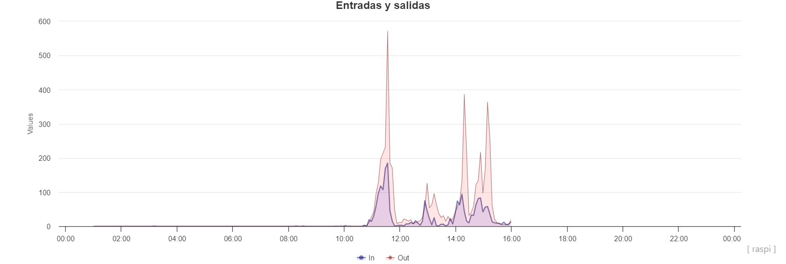

# Splendid BeeCounter

Los contadores de abejas son dispositivos electrónicos que cuentan las abejas que entran y salen de la colmena ininterrumpidamente. Fueron desarrollados recientemente y suscitaron un gran interés por lo relevante de la información que proporcionan.

La información más destacable es la pérdida diaria de abejas, calculada como la diferencia entre el número de abejas que salió y el que entró de la colmena a lo largo de un día.

* In and out along one day: It is late winter... bees are old and mortallty is high*

Sin embargo los contadores desarrollados tenían dos problemas:

* En ocasiones cometían errores de conteo y la validación del contador era muy complicada si no imposible. Esto hizo que no consolidaran como un herramienta de investigación.
* Algunos tipos de contadores (como los basados en optoacopladores) degenaraban rápidamente por la suciedad, el polen, el propoleo y exigían un mantenimiento pesado y costoso.

## Goals

Nuestro objetivo es desarrollar un contador robusto y estable que facilite su validación para su uso en investigación.

En un segundo momento pretendemos crear una red de colmenares monitorizados de manera indefinida que genere un banco de datos para investigación.

## Contibutors, colladorators, help us... and more

     
    <small>David ATauri</small>

TO-DO: añadir a la peña
